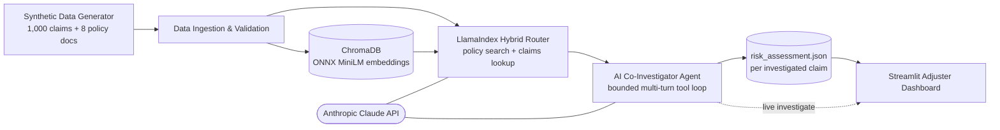

# Insurance Claims RAG Intelligence

An end-to-end fraud-investigation system for insurance claims: a hybrid RAG knowledge base over structured claims data and unstructured policy documents, a genuine multi-step **AI Co-Investigator agent** that reasons over that data using Claude's tool-use API, and a Streamlit dashboard that puts the results in front of a claims adjuster.

Built as a portfolio project to demonstrate production-style generative AI engineering on top of a classical fraud-analytics background: not a single-prompt demo, but a system with a real data pipeline, a bounded and self-correcting agent loop, schema-validated structured output, and an interactive UI — plus the real bugs that surfaced building it, and how they were diagnosed and fixed (see [Engineering Highlights](#engineering-highlights) below).

## Table of Contents

- [Overview](#overview)
- [Architecture](#architecture)
- [Tech Stack](#tech-stack)
- [Key Features](#key-features)
- [Engineering Highlights](#engineering-highlights)
- [Responsible AI Design](#responsible-ai-design)
- [Project Structure](#project-structure)
- [Getting Started](#getting-started)
- [Usage](#usage)
- [Running with Docker](#running-with-docker)
- [Deploying to Streamlit Community Cloud](#deploying-to-streamlit-community-cloud)
- [Example Output](#example-output)
- [Known Limitations & Tradeoffs](#known-limitations--tradeoffs)
- [Development Notes](#development-notes)
- [License](#license)

## Overview

Claims adjusters need to triage a large volume of claims for potential fraud, using both structured data (claim amounts, timing, prior claims) and unstructured guidance (policy documents, SOPs). This project builds that pipeline end to end:

1. Generate a realistic synthetic claims book (1,000 claims, 6% fraud rate) and a set of policy/SOP documents.
2. Ingest and validate the structured data; chunk the policy documents.
3. Embed the policy documents into a local vector store.
4. Build a hybrid retrieval layer that routes a question to either semantic policy search or structured claims lookup.
5. Run an **agent** — not a single LLM call — that investigates one claim at a time: it decides which tools to call, gathers evidence, and produces a schema-validated structured risk assessment.
6. Serve all of it through an interactive dashboard for a claims adjuster to review and trigger new investigations live.

## Architecture



Each stage is a standalone, runnable script that reads the previous stage's output from disk — nothing is re-implemented at a later stage. The agent (stage 5) and the dashboard (stage 6) both import and call the earlier stages' code directly rather than duplicating any retrieval or scoring logic.

## Tech Stack

| Component | Choice | Why |
|---|---|---|
| LLM | Anthropic Claude API | Tool use / structured extraction, agentic reasoning |
| Vector DB | ChromaDB (local, persistent) | Free, simple, no external service dependency |
| Embeddings | `all-MiniLM-L6-v2` via ChromaDB's bundled ONNX export | Avoids a PyTorch dependency entirely (see [Engineering Highlights](#engineering-highlights)) |
| RAG orchestration | LlamaIndex (`RouterQueryEngine`) | Routes between semantic policy search and structured claims lookup |
| Agent loop | Hand-rolled multi-turn tool-use loop over the raw `anthropic` SDK | Sidesteps a real bug found in the LlamaIndex/Anthropic function-calling integration (see below) |
| Structured output | Pydantic | Schema-validates every risk assessment before it's accepted |
| UI | Streamlit + Plotly | Fast to build, good default widgets for an internal tool |
| Data validation | Pydantic + pandas | Type-safe ingestion, strict error handling throughout |

## Key Features

- **Hybrid retrieval**: a single query engine routes between semantic search over policy/SOP documents and structured filtering over the claims table, so the agent can ask either kind of question.
- **A genuine agent, not a single prompt**: the AI Co-Investigator decides for itself which of four read tools to call and in what order (claim lookup, cross-claim relationship matching, policy search, baseline statistics), gathers evidence across multiple turns, and only finishes by calling a terminal `submit_risk_assessment` tool.
- **Schema-enforced output with self-correction**: every submitted assessment is validated against a strict Pydantic model. A validation failure — including a custom check for stray tool-call markup leaking into text fields (see below) — is fed back to the model as a tool error so it can retry, bounded to a small number of attempts.
- **Cross-claim fraud-ring detection**: a dedicated tool finds other claims sharing a vendor, email, phone number, or policy ID with the claim under investigation — the kind of pattern a single-claim lookup can't see.
- **Full audit trail**: every red flag and piece of supporting evidence in a final assessment is required to be grounded in an actual tool call, not free-floating LLM narrative.
- **Live investigation from the UI**: the dashboard's "Investigate now" button calls the same agent code the CLI batch tool uses, and writes to the same output directory — the two are fully interoperable.
- **Ground-truth validation panel**: because the claims book is synthetic with a known fraud label, the dashboard includes a portfolio-only panel comparing the agent's risk level against ground truth (true/false positive/negative breakdown) — a concrete way to show this produces *useful* scores, not just plausible-sounding text.

## Engineering Highlights

This system was built and debugged against the real Anthropic API, not just tested in a mock/sandbox. Four real, non-obvious bugs surfaced only on live runs, each root-caused from evidence rather than guessed at:

**1. A LlamaIndex/Anthropic integration bug in `tool_choice` serialization.** `RouterQueryEngine`'s default selector sent an explicit `tool_choice=None` to the Anthropic API, which the installed SDK serialized as literal `tool_choice: null` — rejected by the API with a 400 error. Root-caused by monkeypatching the SDK's `Messages.create` to intercept the exact kwargs a third-party library was sending, without needing a real API call to do it. Fixed by explicitly constructing an `LLMSingleSelector` (plain-text completion, no `tool_choice` at all) instead of relying on the library's default. This is also why the agent's own tool loop is hand-rolled over the raw SDK rather than built on a LlamaIndex agent class — it avoids this integration layer entirely for the part of the system that uses tool-calling the most.

**2. An SDK version drift breaking a previously-working call.** The installed `anthropic` SDK had removed the `temperature` parameter from `Messages.create()` entirely between versions — confirmed via `inspect.signature()` against the real installed client, not assumed. Every batch investigation failed instantly with a client-side `TypeError`, before any network call was made. Fixed by removing the parameter; a stricter dependency pin isn't used deliberately, since this ecosystem moves fast enough that exact pins have caused their own problems (see [Known Limitations](#known-limitations--tradeoffs)).

**3. A subtle violation of the Anthropic API's tool-use contract under output truncation.** A long agent turn — multiple tool calls plus extended-thinking overhead — could get cut off by `max_tokens` while a *complete* `tool_use` block was already present in the response. The original code branched on `stop_reason != "tool_use"` to decide whether to emit matching `tool_result` blocks, which is the wrong condition: the API requires every `tool_use` block to get a `tool_result` in the very next message regardless of why the turn ended. This left a dangling, unresolved tool call in the conversation history and broke every subsequent request with a 400 error. Fixed by branching on whether the response actually contains `tool_use` blocks, independent of `stop_reason`, and by raising the token budget to make truncation rarer in the first place.

**4. The model leaking its own tool-calling syntax into free-text output fields.** On some fraction of investigations, `submit_risk_assessment`'s `summary` field would end with fragments like `</summary>\n<parameter name="recommended_action">...` — the model's own tool-call markup, leaked into a content string instead of using separate JSON keys. When this happened to swallow a required field, Pydantic already rejected it as missing and the self-correction loop caught it automatically. But when the model *also* supplied a proper duplicate of every field, the malformed text slipped through validation silently and polluted an otherwise "successful" report. This was misdiagnosed on first pass as a copy/paste artifact — it wasn't. Adding targeted logging of every rejected payload (rather than continuing to guess) surfaced the real cause in one round trip. Fixed with a regex-based validator wired into Pydantic field validators on every free-text field, routing detections into the existing retry loop — confirmed on a live run to catch and correct this exact behavior multiple times before it could reach a final report.

The tradeoff exposed by fix #4 (some investigations now cost an extra API round trip) was surfaced explicitly and a deliberate decision was made to accept it rather than over-engineer a prompt-tuning fix for a cosmetic, fully-mitigated issue — see [Known Limitations](#known-limitations--tradeoffs).

## Responsible AI Design

Insurance fraud scoring is a real regulatory and fairness-sensitive domain. Two concrete guardrails were designed in from the start, not bolted on:

- The agent's system prompt explicitly restricts it to reasoning about objective behavioral and financial signals — timing, amounts, vendor/contact overlaps, deviation from policy — and explicitly instructs it **not** to reason about claimant name or any demographic-adjacent attribute.
- The dashboard echoes this at the UI layer: claimant name and contact info are shown in the per-claim detail view (an adjuster legitimately needs them to work the case) but are deliberately not exposed as sort/filter/search fields in the claims overview table, so the interface doesn't invite sorting the book by identity.

## Project Structure

```
Insurance Claims RAG Intelligence/
├── Python/
│   ├── synthetic_data_generator.py        # Step 1: synthetic claims + policy docs
│   ├── data_ingestion_pipeline.py         # Step 2: validation + chunking
│   ├── embeddings_vectorstore_pipeline.py # Step 3: ONNX embeddings -> ChromaDB
│   ├── rag_query_engine.py                # Step 4: LlamaIndex hybrid RAG router
│   ├── fraud_investigator_agent.py        # Step 5: AI Co-Investigator agent
│   ├── claims_adjuster_dashboard.py       # Step 6: Streamlit UI
│   └── requirements.txt
├── data/                                  # generated at runtime, not committed (see .gitignore)
│   ├── synthetic/
│   ├── processed/
│   ├── chroma_db/
│   └── risk_assessments/
├── examples/
│   └── risk_assessments/                  # sample agent output, committed for reference
├── Dockerfile
├── docker-compose.yml
├── docker-entrypoint.sh
├── .env                                   # not committed -- holds ANTHROPIC_API_KEY
└── README.md
```

## Getting Started

**Prerequisites:** Python 3.11+, an [Anthropic API key](https://console.anthropic.com).

```bash
git clone <your-repo-url> "Insurance Claims RAG Intelligence"
cd "Insurance Claims RAG Intelligence"
python3 -m venv .venv
source .venv/bin/activate
python3 -m pip install -r "Python/requirements.txt"
```

Create a `.env` file in the project root:

```
ANTHROPIC_API_KEY=sk-ant-...
```

## Usage

Run each stage in order the first time (all outputs land under `./data/`, so always run from the project root):

```bash
python3 "Python/synthetic_data_generator.py"
python3 "Python/data_ingestion_pipeline.py"
python3 "Python/embeddings_vectorstore_pipeline.py"
python3 "Python/rag_query_engine.py"        # optional: try the hybrid RAG router directly
python3 "Python/fraud_investigator_agent.py" --top-n 5   # batch-investigate the 5 riskiest claims
```

Then launch the dashboard:

```bash
streamlit run "Python/claims_adjuster_dashboard.py"
```

This opens a browser tab at `http://localhost:8501`. From there you can review existing risk assessments or trigger a live investigation for any claim in the book.

## Running with Docker

The included `Dockerfile` and `docker-compose.yml` bootstrap the entire data pipeline automatically on first run — no need to run the five setup scripts by hand.

```bash
cp .env.example .env   # then add your real ANTHROPIC_API_KEY
docker compose up --build
```

The first startup generates the synthetic data, builds the vector store, and starts the dashboard at `http://localhost:8501`. Data is persisted to `./data` on the host via a volume mount, so subsequent restarts (`docker compose up`) skip regeneration and start in seconds.

To run without Compose:

```bash
docker build -t claims-rag-intelligence .
docker run -p 8501:8501 --env-file .env -v "$(pwd)/data:/app/data" claims-rag-intelligence
```

## Deploying to Streamlit Community Cloud

1. Push this repository to GitHub:
   ```bash
   git remote add origin https://github.com/<your-username>/<your-repo>.git
   git branch -M main
   git push -u origin main
   ```
2. Go to [share.streamlit.io](https://share.streamlit.io) and sign in with GitHub.
3. Click **New app**, select this repository and branch, and set the main file path to `Python/claims_adjuster_dashboard.py`.
4. Under **Advanced settings → Secrets**, add:
   ```
   ANTHROPIC_API_KEY = "sk-ant-..."
   ```
5. Deploy. Note that Streamlit Community Cloud's filesystem is ephemeral and ChromaDB/the synthetic data won't already exist there — either commit the generated `data/` directory to the repo for a always-ready public demo, or add a one-time setup step in the app itself. (This project's `.gitignore` excludes `data/` by default since it's fully reproducible; if you want a public demo to work out of the box, remove that line and commit `data/synthetic/`, `data/processed/`, and `data/chroma_db/`.)

## Example Output

A sample of the agent's real, live-verified output is committed in [`examples/risk_assessments/`](examples/risk_assessments/) so you can see the shape of a result without running anything. Each file is a schema-validated `RiskAssessment`: a risk level and 0-100 score, a plain-English summary, a list of red flags and supporting evidence (each grounded in an actual tool call), any related claims found, a recommended action, and the agent's own confidence.

## Known Limitations & Tradeoffs

- **Synthetic data only.** The claims book and policy documents are generated (Step 1, seeded and reproducible), not real claims data. The ground-truth validation panel in the dashboard only works because of this.
- **`requirements.txt` uses minimum-version pins (`>=`), not exact pins**, deliberately — this ecosystem (LlamaIndex, the Anthropic SDK) moves fast, and this project has already hit real bugs from both a floating version resolving something newer than expected *and* from an exact pin referencing a version that was later retracted from PyPI. Pin exactly if you need long-term reproducibility; expect to occasionally re-verify against a newer resolved version otherwise.
- **The model occasionally needs a validation retry.** On live runs, the underlying model appends stray tool-calling-style markup into free-text fields on a meaningful fraction of investigations (observed around 60%). This is always caught by the schema validator before it can reach a final report — nothing malformed ever ships — but each caught case costs one extra API round trip. This was evaluated and deliberately left as-is rather than spending further effort tuning it away, since the system is already correct and the cost is a UX latency tradeoff, not a correctness one.
- **No automated CI or integration tests against the live API** — there's a sandbox-only unit test suite for the agent's control flow and validation logic (mocked Anthropic client), but no automated test hits the real API. All "confirmed" claims in this README and the codebase reflect manual, real runs.
- **Intel-Mac note (if you hit this):** PyPI's PyTorch wheels stop at 2.2.2 for macOS x86_64, while modern `sentence-transformers` needs PyTorch ≥ 2.5. This project deliberately avoids that dependency entirely by using ChromaDB's bundled ONNX embedding export instead — if you fork this and add a library that transitively pulls in `sentence-transformers` or PyTorch, check for an ONNX/API-based alternative first on that platform.

## Development Notes

This project was built iteratively with Claude (Anthropic) as an AI pair-programmer, working strictly step by step: one component at a time, verified against real runs before moving on. Every bug described in [Engineering Highlights](#engineering-highlights) was found on a real run against the live Anthropic API and root-caused from actual evidence (SDK introspection, intercepted request payloads, logged rejected model output) rather than guessed at — that process is as much a part of this portfolio piece as the final code.

## License

MIT — see [LICENSE](LICENSE). Feel free to adapt the structure or approach for your own projects.
